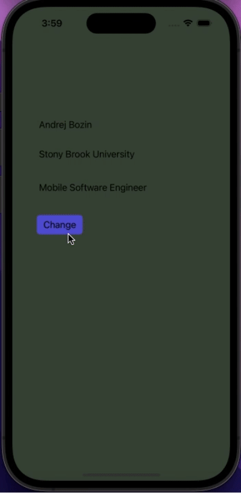

# Prework - *Color Changer*

Submitted by: **Andrej Bozin**

**Color Changer** is an app that changes the background color to a random color when pressing a button. 

Time spent: **1** hour spent in total

## Required Features

The following **required** functionality is completed:

- [ ] Users are see a screen with three labels and a button
- [ ] Tapping the button changes the screen color to a random color
 

## App Brainstorming (Step 4)
### App Brainstorming

#### Favorite Applications:

1. **Notion**
   - Flexible and customizable workspace organization
   - Collaborative editing and sharing features
2. **Headspace**
   - Guided meditation sessions for various needs
   - Personalized progress tracking and reminders
3. **Google Maps**
   - Accurate navigation and real-time traffic updates
   - Integration with public transportation and local business information

#### App Idea: 

**MindFlow**

MindFlow is a mindfulness app that combines elements from various meditation and productivity apps. It aims to provide personalized and guided meditation sessions while incorporating task management and productivity tools. Users can customize meditation routines based on their preferences, integrating calming sounds, guided sessions, and breathing exercises. The app will also feature a task manager with a unique twist:
   - Encouraging users to set intentions before starting tasks
   - Progress tracking
   - Reminders for both meditation sessions and tasks
   - A community aspect for sharing experiences and tips on staying focused and mindful throughout the day.

## Challenges
Using ctrl+ click and drag to establish a connection with the button was not working for me. Luckily I was able to resolve this issue with the help of technologie's silver bullet.

## License

    Copyright [2023] [Andrej Bozin]

    Licensed under the Apache License, Version 2.0 (the "License");
    you may not use this file except in compliance with the License.
    You may obtain a copy of the License at

        http://www.apache.org/licenses/LICENSE-2.0

    Unless required by applicable law or agreed to in writing, software
    distributed under the License is distributed on an "AS IS" BASIS,
    WITHOUT WARRANTIES OR CONDITIONS OF ANY KIND, either express or implied.
    See the License for the specific language governing permissions and
    limitations under the License.
